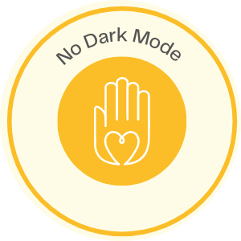

# <div align="center"><h3>No Dark Mode 🌙</h3></div>


<div align="center"><h3>Silly website that won't allow dark mode</h3></div>

<div align="center"></div>

## Check the website at : 

```
https://nodarkmode.web.app/
```

## Youtube Video :
```
https://www.youtube.com/watch?v=1l8UnV8nD60
```


## Run the app
1. Clone the project
2. Run ```npm i ```
3. Run ```npm start```


